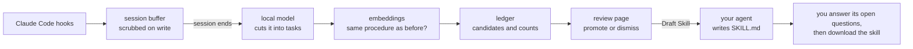

# Skill Plus Plus

**Turn the work you keep repeating with Claude Code into skills you review.**

Agent skills make an agent reliable at a procedure, but almost nobody writes
them: by the time a procedure is worth a skill, you have already done it three
times and moved on. skillpp watches your Claude Code sessions, notices when you
repeat the same kind of work, and when you say so, has your own agent draft the
`SKILL.md` from what you actually did. Nothing is installed without you.

Detection runs on your machine with small local models (Ollama). The frontier
model is only asked to write, and only when you press **Draft Skill**.

## How it works



1. **Capture.** Four hooks record your prompts, the tools that ran, and the
   agent's replies. Secrets, tokens and emails are scrubbed before anything is
   written.
2. **Cut into tasks.** When a session ends, a detached worker asks a local model,
   at each point where you typed something, whether a new task started there.
3. **Recognise repeats.** Each task is compared with what is already in the
   ledger. Seen three times, it becomes a candidate you can promote.
4. **Draft.** On the review page, **Draft Skill** hands the candidate's first run
   to your own agent (`claude -p` by default). You can add a note on what to look
   out for. The agent writes the procedure in its own words, and anything it
   could not tell from the run becomes an open question for you.
5. **Review.** Answer the open questions, revise if needed, then download the
   skill as a zip and unzip it into your skills folder.

## Requirements

- macOS or Linux, Python 3.10 or newer (the standard library only)
- [Claude Code](https://docs.anthropic.com/en/docs/claude-code), with `claude` on
  your PATH and logged in (run `claude`, then `/login`)
- [Ollama](https://ollama.com) with two models, about 8 GB of free memory while
  the larger one is loaded:

  ```bash
  ollama pull gemma4:e4b         # cuts sessions into tasks, names candidates
  ollama pull nomic-embed-text   # decides whether two tasks are the same procedure
  ```

## Quickstart

```bash
pipx install git+https://github.com/himanshu096/skill-plus-plus
skillpp install --project ~/code/my-repo --apply   # wire the hooks into one repo
skillpp doctor                                     # hooks, Ollama, models: all green?
```

Restart Claude Code in that repo (hooks load when a session starts) and work as
usual. Then open the review page:

```bash
skillpp web
```

Use `--user` instead of `--project` to capture every project. `skillpp install`
is a dry run until you add `--apply`, backs up your settings file, and
`--remove --apply` takes everything out again.

**A first skill without waiting for three repeats:** run `/skillpp-keep` in a
session (or `skillpp keep`) to save the work so far as a candidate, then
`skillpp draft <id> --apply`. `SKILLPP_RECURRENCE=1` makes every candidate ready
at once.

### Installing a drafted skill

Downloaded skills are zips holding `<name>/SKILL.md`. Unzip into
`~/.claude/skills/` (every project) or `<repo>/.claude/skills/` (one repo), and
record it:

```bash
skillpp promote <id> --skill-path ~/.claude/skills/<name>/SKILL.md
```

## The review page

`skillpp web` serves a page on `127.0.0.1:8765` that only this machine can reach.

- **Candidates** lists what skillpp saw you repeat, most-seen first, with a
  summary and the steps grouped under the requests they served. Promote or
  dismiss what reached three; **Draft Skill** a promoted one.
- **Drafts** shows each finished draft rendered, with its open questions. A draft
  downloads once every question is answered; **Revise** sends the agent an
  instruction and updates the draft in place.

## Commands

Every command prints its flags with `skillpp <command> --help`. Anything that
edits settings or spends a model call is a dry run until you add `--apply`.

| For | Commands |
| --- | --- |
| Setting up | `install`, `doctor` |
| Reviewing | `web`, `review`, `show`, `search`, `stats` |
| Deciding | `promote`, `dismiss`, `reopen`, `ignored` |
| Drafting | `draft`, `revise`, `name`, `scaffold`, `keep`, `dictate` |
| Fixing candidates | `split`, `merge`, `retitle`, `sift` |
| Skills you have | `lifecycle`, `tier`, `check`, `reconcile`, `bundle`, `expire`, `accuracy` |
| Internal (run by the hooks) | `hook`, `fold-session`, `fold-pending` |

## Configuration

All settings are environment variables.

| Variable | Default | What it does |
| --- | --- | --- |
| `SKILLPP_ROOT` | `~/.claude/skillpp` | where the ledger, sessions and drafts live |
| `SKILLPP_RECURRENCE` | `3` | times a task must repeat before it can be promoted |
| `SKILLPP_TTL_DAYS` | `14` | how long `skillpp expire` keeps a candidate still collecting |
| `SKILLPP_OLLAMA` | `http://127.0.0.1:11434` | the Ollama server |
| `SKILLPP_LOCAL_MODEL` | `gemma4:e4b` | the model that cuts sessions and names candidates |
| `SKILLPP_EMBED_MODEL` | `nomic-embed-text` | the model that matches repeats |
| `SKILLPP_MATCH_FLOOR` | `0.93` | similarity at which two runs' commands count as the same procedure |
| `SKILLPP_MATCH_FLOOR_TURNS` | `0.85` | the same, for runs compared by their conversation |
| `SKILLPP_AGENT` | `claude -p {PROMPT} …` | how to invoke your agent for drafts; `{PROMPT}` is replaced |
| `SKILLPP_JUDGE` | `1` | `0` stops judging; sessions are then held, and only `keep` banks |
| `SKILLPP_NAME` | `1` | `0` stops the model naming new candidates |
| `SKILLPP_MATCH` | `1` | `0` banks every task without comparing it (for measuring detection) |
| `SKILLPP_DESCRIBE` | `0` | `1` asks the model to describe every tool call, inside the hook (slow) |
| `SKILLPP_MAX_STEPS` / `SKILLPP_MAX_FIELD` | `500` / `2000` | caps per session and per captured field |
| `SKILLPP_INTERNAL` | unset | set to anything to make the hooks do nothing, e.g. for one session |

## Privacy

Everything skillpp captures stays in `~/.claude/skillpp/` on your machine, and
the local models run there too. Prompts, tool inputs (up to 2,000 characters
each), the start of each tool result and the agent's replies are stored after
scrubbing keys, tokens, connection strings and email addresses. Names, phone
numbers and the content of your files are **not** recognised, so treat the
ledger as you would your shell history.

Something leaves your machine only when you press **Draft Skill** or **Revise**:
the candidate's run is then read by your agent, which uses its own model. Nothing
expires automatically. See [docs/privacy.md](docs/privacy.md) for exactly what is
stored where.

## Known limits

- **A task continued in a new chat becomes two half-tasks.** Everything is keyed
  by the chat, and nothing links one chat to the next.
- **Two tasks with no prompt between them look like one.** The judge only looks
  where you typed something.
- **A review request can be cut off as a new task** ("Two things. Check every
  command…"), which splits one procedure into two candidates.
- **Matching is strict on purpose.** A wrong merge would mix two procedures into
  one skill, so similar work on different material sometimes stays separate.
- **A draft reads one run**, the first. Use the note on **Draft Skill** to tell
  the agent what the later runs taught you.
- Capture works in the Claude Code CLI. The draft agent defaults to Claude Code
  too, but any agent CLI can be set with `SKILLPP_AGENT`.

The measurements behind these are in [docs/research/](docs/research/).

## Documentation

- [docs/usage.md](docs/usage.md): install scopes, daily use, drafting, troubleshooting, uninstalling
- [docs/privacy.md](docs/privacy.md): what is captured, where it lives, what leaves the machine
- [docs/architecture.md](docs/architecture.md): the pipeline and the modules, for contributors
- [docs/design.md](docs/design.md): the original design document
- [docs/research/](docs/research/): the lab log of every measurement that shaped the defaults

## Contributing

See [CONTRIBUTING.md](CONTRIBUTING.md). The test suite needs no model and runs in
about ten seconds: `python3 -m unittest discover -s tests`.

## License

See [LICENSE](LICENSE).
