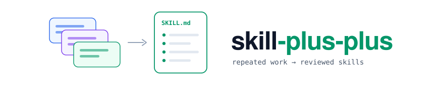
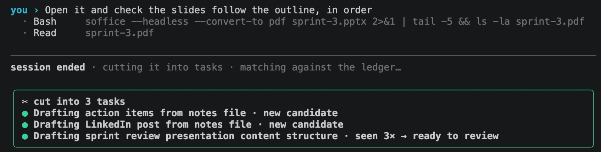
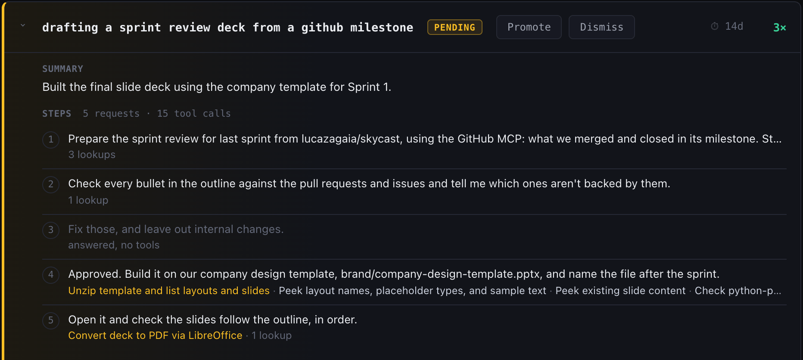
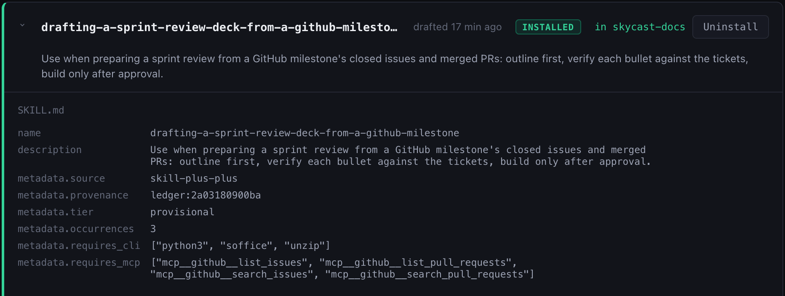
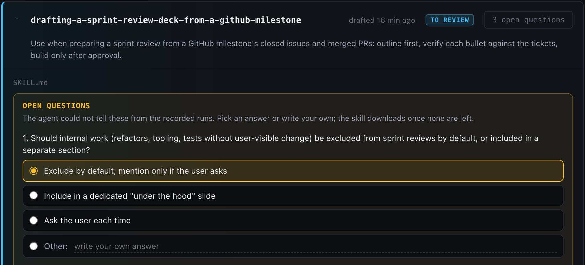
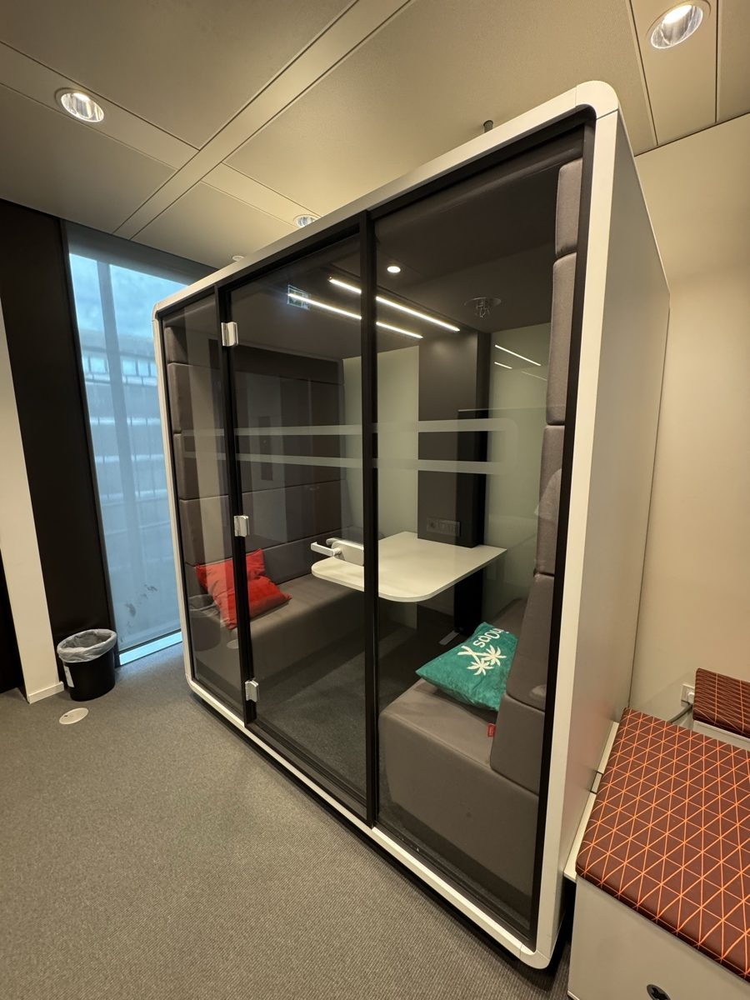

<div align="center">

<picture>
  <source media="(prefers-color-scheme: dark)" srcset="docs/images/banner-dark.svg">
  
</picture>

# Spot the work you keep repeating. Turn it into skills.

**Skills are usually written by hand. Skill++ writes them from the work you already did.**

A local model cuts your Claude Code sessions into tasks and spots the procedures
you repeat; on the third run, your own agent writes one down as a skill. Nothing
about how you work changes.

https://github.com/user-attachments/assets/e18baeb6-2ec4-4b33-be42-d77eb7d6af0a

<a href="LICENSE"></a>


🆓 **Runs on local models: no tokens, no API calls, no cost.** Your agent is called only when you ask it to write a skill.

📏 **Tested on 30 public recordings anyone can replay: every change of task found, not one task split by mistake, not one run counted toward the wrong skill.** **[→ Under the hood](#-under-the-hood)**

⚡ **Three commands, no account.** **[→ Quick Start](#-quick-start)**

</div>

---

<div align="center">

**[See it](#-see-it) · [Why](#-why-this-exists) · [How it works](#-how-it-works) · [What it costs](#-what-it-costs-nothing-until-you-ask) · [Under the hood](#-under-the-hood) · [Quick Start](#-quick-start) · [Your first skill](#-your-first-skill) · [The numbers](#-the-numbers) · [When to use](#-when-to-use--when-to-skip) · [Docs](docs/usage.md)**

</div>

---

## 👀 See it

Every sprint, the same review deck: read what was merged and closed on GitHub,
outline the slides, check every bullet against the tickets, build it on the
company template. The third time, Skill++ has it ready.

**① You work as usual.** Three jobs in one chat: action items, a LinkedIn post,
the sprint review. When the session ends, a local model cuts it into its tasks
and counts the sprint review a third time.



**② It shows you the repeat.** On the review page, the candidate is at 3× and
ready to promote, with every request you made and the tools each one used.



**③ Your agent writes the skill.** Drafted from the first run: when to use it,
the procedure, and the GitHub MCP tools it needs. Installed in the project,
where Claude Code picks it up.



This is the session from the video above: real Claude Code, with the GitHub MCP.
It is one of the public recordings
([6b143dec-demo-take.json](tests/fixtures/sessions/6b143dec-demo-take.json)),
so you can replay what it did.

---

## 🌍 Why this exists

Every team has procedures it runs again and again: the sprint review deck,
shipping a small feature with its tests, turning a document into a talk. An agent skill
(`SKILL.md`) makes an agent follow such a procedure the same reliable way every
time, but almost nobody writes them: by the time a procedure is worth a skill,
you have done it three times and moved on.

Skill++ finds those procedures for you. It watches your Claude Code sessions,
with no tags, rules or notes from you, notices when you repeat the same kind of
work within a project, and shows it to you as a candidate. Promote one, and
your own agent drafts the skill from what you actually did. Nothing is installed
without you.

**Skills reach your team today:** install one into the repo's `.claude/skills/`,
commit it, and everyone working in the repo has it. **Where it is going:**
skills shared across a team, so that a procedure one person worked out is done
the same way by everyone: faster, and without the mistakes each person would
otherwise make on their own.

---

## 🔧 How it works

<picture>
  <source media="(prefers-color-scheme: dark)" srcset="docs/images/how-it-works-dark.svg">
  
</picture>

1. **Capture.** While you work, hooks record your prompts, the tools that ran,
   and the agent's replies into one file per session. Secrets, tokens and
   emails are scrubbed before anything is written. When the session ends, it is
   handed on; a session that could not be (the app was quit, say) is picked up
   the next time one starts.
2. **Fold.** A background worker asks a local model, at each point where you
   typed something, whether a new task started there, and splits the session
   into tasks. Each task is compared with the candidates of the same project:
   the same procedure again adds to its count, anything else becomes a new
   candidate.
3. **Review and draft.** Seen three times, a candidate is ready on the review
   page, where you promote or dismiss it. **Draft Skill** hands its first run to
   your own agent (`claude -p` by default), with a note from you if you like.
   The agent writes the procedure in its own words, and anything it could not
   tell from the run becomes an open question. Answer them, then install the
   skill into the project or just for you.

---

## 💸 What it costs: nothing, until you ask

Watching, cutting and matching run on two open models on your machine
(`gemma4:e4b` and `nomic-embed-text`, through Ollama): no tokens, no API calls,
and nothing leaves your laptop. The only call to a frontier model is your own
agent writing the skill: once per draft or revision, and only when you press
**Draft Skill** or **Revise**. Only then does that one run's conversation go to
it.

---

## 🧠 Under the hood

Three problems stand between a chat log and a skill. The first two are solved
on your machine by two small open models, with no tokens and no API calls; the
third is one call to your own agent. Every number below is measured on the 30
public recordings in [tests/fixtures/sessions/](tests/fixtures/sessions/),
which anyone can replay.

### 1. Where does one task end?

One chat is rarely one task. At every message you typed between two tool calls,
Skill++ asks a local model (`gemma4:e4b`, through Ollama) one question: 113
questions for 415 tool calls across the recordings. The question sets the
earlier task and your new message side by side in named sections, says what
counts as a new task, and asks for one word. It runs in the background after
the session ends, in under a second and a half per message.

**Every one of the 13 task switches found, 0 false cuts in 100 places** where a
review, a correction or a follow-up must stay in its task.

### 2. Is this the same procedure again?

Each task is embedded (`nomic-embed-text`) as its conversation: your requests,
the first 300 characters of each reply, the skills it used and the kinds of
files it produced. File names are masked, so what a run was about does not
decide what it was. A task joins a candidate only at a cosine similarity of
0.85 or more (0.93 when there is no conversation to compare): a duplicate you
can see is cheap, and a wrong merge would mix two procedures into one skill.

**0 wrong merges**, the number that matters most here: a run counted toward the
wrong candidate would make a skill of two procedures. **5 of the 8 repeated
procedures became a single candidate**, the seven sprint reviews among them.

### 3. What goes into the skill?

Your own agent (`claude -p` by default, or any agent CLI) drafts it from the
candidate's first run and your note: the method, in its own words, not the
subject of that run. What it cannot tell from the run becomes an open question,
at most three, each with three suggested answers, and your answers are folded
back in. The result is a standard `SKILL.md`, and it keeps working without
Skill++. The CLIs and MCP tools the run needed become the skill's requirements,
and a skill whose requirement is missing says so and stops instead of
improvising a workaround.

**The method was right in all 4 drafts checked**, by a Claude judge that has to
quote the line of the draft behind every yes.

### And the parts you don't see

- Keys, tokens, cookies, connection strings and email addresses are scrubbed
  before anything is written.
- A session the app was quit on is picked up the next time one starts.
- The review page listens on `127.0.0.1` only and refuses requests from other
  pages.
- 530 tests run in about ten seconds, with no model. The
  [research log](docs/research/) keeps every experiment, the failed ones too.

---

## ⚡ Quick Start

You need macOS or Linux, Python 3.10+, [Claude Code](https://docs.anthropic.com/en/docs/claude-code)
logged in, and [Ollama](https://ollama.com) running (`brew install ollama` on a Mac).

```bash
pipx install skill-plus-plus
skill-plus-plus install --project ~/code/my-repo --apply   # hooks, slash commands and the two local models
skill-plus-plus doctor                                     # everything green?
```

Then start a new Claude Code session in that repo (a new chat in the CLI, or a
new Code session in the desktop app) and work as usual.

<details>
<summary><strong>More ways in</strong> · every project, dry runs, removing it, from a clone</summary>

<br>

- `install` without `--apply` only shows what it would do, downloads included.
  Your settings file is backed up before it is changed.
- `--user` instead of `--project` captures every project on the machine.
- The two models are about 10 GB on disk, and cutting a session needs about
  10 GB of free memory. `--no-models` leaves Ollama alone.
- `skill-plus-plus install --project ~/code/my-repo --remove --apply` takes the hooks
  and slash commands out again.
- The latest `main`, before it is released:
  `pipx install git+https://github.com/himanshu096/skill-plus-plus`.
- From a clone: `pip install -e .`, or run `python3 bin/skill-plus-plus` without
  installing anything.

</details>

---

## 🕐 Your first skill

1. **Work as usual.** Each session is cut into tasks when it ends, in the
   background.
2. **Open the review page:** `skill-plus-plus web`. It is served on `127.0.0.1` and only
   this machine can reach it.
3. **Pick the project** in the menu at the top right.
4. **Candidates** lists what you repeated, most-seen first, each with a summary
   and its steps grouped under the requests they served (② above). At three
   runs, a candidate can be promoted or dismissed.
5. **Promote** it, then press **Draft Skill**. The optional note tells the agent
   what the later runs taught you: it reads only the first.
6. **Answer its open questions** on the Drafts tab: pick a suggested answer or
   write your own. Each answer is folded back into the skill; **Revise** sends
   any other instruction.

   

7. **Install in your project** (commit `.claude/skills/` to share it), or **just
   for you** (③ above). A later revision reaches it with **Update**.

**Faster than three repeats:** `SKILL_PLUS_PLUS_RECURRENCE=1` makes a candidate ready the
first time it is seen.

---

## 📊 The numbers

Measured on the 30 public recordings of code and knowledge work in
[tests/fixtures/sessions/](tests/fixtures/sessions/), which anyone can replay
with the commands below, with the defaults (`gemma4:e4b`, `nomic-embed-text`).
Eight of them are the recordings of the video above, which were held out while
the judge's question was tuned. The weak rows stay in the tables.

**Where one task ends**: 30 of 30 sessions right; 13 of 13 task switches
caught; **0 false cuts over 100 prompts**, reviews, corrections and side
questions included.

| Check | Code | Knowledge work |
|---|---|---|
| one task, several follow-ups | 7/7 | 11/11 |
| reviews and corrections stay in the task | 1/1 | 10/10 |
| a switch nobody announced | 1/1 | 1/1 |
| an announced switch | 1/1 | 1/1 |
| three tasks in one chat | 1/1 | 3/3 |
| a second task of the same kind | 1/1 | – |

**Do repeats become one candidate**: **0 wrong merges. This is the number that
matters most.** A wrong merge counts a run toward the wrong candidate: it looks
repeated before it is, and the skill drafted from it mixes two procedures. A
missed merge only leaves a second candidate you can see and dismiss.

| Procedure in the recordings | Runs | Candidates |
|---|---|---|
| sprint review deck from GitHub | 7 | 1 |
| talk deck from docs | 4 | 1 |
| release notes from a changelog | 3 | 1 |
| refactor, tests kept green | 3 | 1 |
| Makefile for a project | 2 | 1 |
| LinkedIn post from notes | 6 | 2 |
| action items from meeting notes | 5 | 2 |
| a code feature with tests (seven different features) | 12 | 7 |

That is why Skill++ keeps a second candidate when in doubt.

**Drafts**: on four recorded sessions, every draft's method was right, checked
by a Claude judge that quotes the line of the draft behind every yes. All four
say when to use the skill; none leaks a path from the run.

Reproduce them with `score.py`, `recurrence.py`,
`tests/benchmarks/judge_replay.py` and `tests/benchmarks/draft_check.py`. The
[research log](docs/research/) has every measurement behind them, and more,
including sessions of our own work that we cannot publish.

---

## 🧭 When to use · when to skip

**Good fit if you** repeat procedures in Claude Code (the CLI or the desktop
app's Code tab), on macOS or Linux, with about 10 GB of memory to spare for the
local model.

**Skip it if you** mostly do one-off work, run Windows, or use another agent:
capture is Claude Code only for now. Drafting can use any agent CLI
(`SKILL_PLUS_PLUS_AGENT`).

**Known limits**
- A task continued in a new chat becomes two half-tasks; nothing links one chat
  to the next.
- Two tasks in one prompt look like one: the judge only looks where you typed
  something.
- A draft reads one run, the first. The note on **Draft Skill** carries what the
  later ones taught you.

---

## 🔒 Privacy

Everything Skill++ captures stays in `~/.claude/skill-plus-plus/` on your machine,
scrubbed of keys, tokens, cookies, connection strings and email addresses.
Names, phone numbers and the content of your files are **not** recognised, and
the folder you work in is kept as it is, so treat it like your shell history. Something leaves your machine only when you press **Draft
Skill** or **Revise**. Nothing expires automatically.
[docs/privacy.md](docs/privacy.md) says exactly what is stored where.

## 🤝 Contributing

The most useful contribution is a recorded session of real, public work,
especially two tasks in one chat or a task finished in a second chat.
[CONTRIBUTING.md](CONTRIBUTING.md) explains how to record one, run the tests (no
model needed, about ten seconds) and measure a change.

## 📜 License

[MIT](LICENSE).

## 🏠 Where it was made

<p align="center">
  
</p>
<p align="center"><sub>Skill++ headquarters: one meeting pod, where it all started.</sub></p>

---

<sub>
<strong>Docs:</strong>
<a href="docs/usage.md">Usage, commands and settings</a> ·
<a href="docs/privacy.md">Privacy</a> ·
<a href="docs/architecture.md">Architecture</a> ·
<a href="docs/research/">Research log</a> ·
<a href="CONTRIBUTING.md">Contributing</a> ·
<a href="SECURITY.md">Security</a> ·
<a href="CHANGELOG.md">Changelog</a>
</sub>
