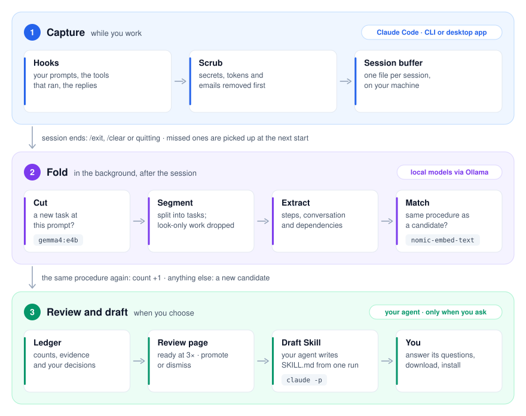

# Skill Plus Plus

**Spot the work you keep repeating with Claude Code, and turn it into skills you review.**

Every team has procedures it runs again and again: shipping a small feature with
its tests, turning a document into a talk, adding an eval case. An agent skill
(`SKILL.md`) makes an agent follow such a procedure the same reliable way every
time, but almost nobody writes them: by the time a procedure is worth a skill,
you have done it three times and moved on.

skillpp finds those procedures for you. It watches your Claude Code sessions,
notices when you repeat the same kind of work, and shows it to you as a
candidate. Promote one, and your own agent drafts the skill from what you
actually did. Nothing is installed without you.

**What it costs.** Watching and detecting run entirely on your machine, with
small local models (Ollama): no API calls, no cost, and nothing leaves your
laptop. The frontier model is called only at the very end, once per skill:
after you have promoted a candidate and pressed **Draft Skill**. Only then does
that one run's conversation go to it.

**Where it is going.** The goal is skills shared across a team, so that a
procedure one person worked out is done the same way by everyone: faster, and
without the mistakes each person would otherwise make on their own. This first
version works end to end for one person, from your sessions to a skill in your
skills folder. Sharing is still by hand: download the skill and pass it on, or
commit it to your repo's `.claude/skills/` so everyone working in it gets it.

## How it works

<picture>
  <source media="(prefers-color-scheme: dark)" srcset="docs/images/how-it-works-dark.svg">
  
</picture>

1. **Capture.** While you work, hooks record your prompts, the tools that ran,
   and the agent's replies into one file per session. Secrets, tokens and
   emails are scrubbed before anything is written. When the session ends, it is
   handed on; a session that could not be (the app was quit, say) is picked up
   the next time one starts.
2. **Fold.** A background worker asks a local model, at each point where you
   typed something, whether a new task started there, and splits the session
   into tasks. Each task is compared with what the ledger already holds: the
   same procedure again adds to its count, anything else becomes a new
   candidate.
3. **Review and draft.** Seen three times, a candidate is ready on the review
   page, where you promote or dismiss it. **Draft Skill** hands its first run to
   your own agent (`claude -p` by default), with a note from you if you like.
   The agent writes the procedure in its own words, and anything it could not
   tell from the run becomes an open question. Answer them, revise if needed,
   then download the skill and unzip it into your skills folder.

## Requirements

- macOS or Linux, Python 3.10 or newer (the standard library only)
- [Claude Code](https://docs.anthropic.com/en/docs/claude-code), with `claude` on
  your PATH and logged in (run `claude`, then `/login`)
- [Ollama](https://ollama.com) installed and running (`brew install ollama` on a
  Mac). skillpp downloads the two local models it needs while it installs:
  about 10 GB on disk, and about 10 GB of free memory while it cuts a session.

## Quickstart

```bash
pipx install git+https://github.com/himanshu096/skill-plus-plus
skillpp install --project ~/code/my-repo --apply   # hooks, slash commands and the two local models
skillpp doctor                                     # everything green?
```

Start a new Claude Code session in that repo (a new chat in the CLI, or a new
Code session in the desktop app): hooks load when a session starts. Work as
usual, then open the review page:

```bash
skillpp web
```

**A first skill without waiting for three repeats:** run `/skillpp-keep` in a
session (or `skillpp keep`) to save the work so far as a candidate, then
`skillpp draft <id> --apply`. `SKILLPP_RECURRENCE=1` makes every candidate ready
at once.

**Install options.** Without `--apply`, `install` only shows what it would do,
downloads included. `--user` instead of `--project` captures every project;
`--no-models` leaves Ollama alone; `--remove --apply` takes the hooks and
commands out again. Your settings file is backed up before it is changed.

### Installing a drafted skill

Downloaded skills are zips holding `<name>/SKILL.md`. Unzip into
`~/.claude/skills/` (every project) or `<repo>/.claude/skills/` (one repo, and
everyone who works in it), then tell skillpp where it went, so the review page
shows the candidate as installed:

```bash
skillpp promote <id> --skill-path ~/.claude/skills/<name>/SKILL.md
```

## The review page

`skillpp web` serves a page on `127.0.0.1:8765` that only this machine can reach.

- **Candidates** lists what skillpp saw you repeat, most-seen first, with a
  summary and the steps grouped under the requests they served. Promote or
  dismiss what reached three; **Draft Skill** a promoted one.
- **Drafts** shows each finished draft rendered, with its open questions. A draft
  downloads once every question is answered; **Revise** sends the agent an
  instruction and updates the draft in place.

## Commands

Every command prints its flags with `skillpp <command> --help`. Anything that
edits settings or spends a model call is a dry run until you add `--apply`.

| For | Commands |
| --- | --- |
| Setting up | `install`, `doctor` |
| Reviewing | `web`, `review`, `show`, `search`, `stats` |
| Deciding | `promote`, `dismiss`, `reopen`, `ignored` |
| Drafting | `draft`, `revise`, `name`, `scaffold`, `keep`, `dictate` |
| Fixing candidates | `split`, `merge`, `retitle`, `sift` |
| Skills you have | `lifecycle`, `tier`, `check`, `reconcile`, `bundle`, `expire`, `accuracy` |
| Internal (run by the hooks) | `hook`, `fold-session`, `fold-pending` |

## Configuration

All settings are environment variables.

| Variable | Default | What it does |
| --- | --- | --- |
| `SKILLPP_ROOT` | `~/.claude/skillpp` | where the ledger, sessions and drafts live |
| `SKILLPP_RECURRENCE` | `3` | times a task must repeat before it can be promoted |
| `SKILLPP_TTL_DAYS` | `14` | how long `skillpp expire` keeps a candidate still collecting |
| `SKILLPP_OLLAMA` | `http://127.0.0.1:11434` | the Ollama server |
| `SKILLPP_LOCAL_MODEL` | `gemma4:e4b` | the model that cuts sessions and names candidates |
| `SKILLPP_EMBED_MODEL` | `nomic-embed-text` | the model that matches repeats |
| `SKILLPP_MATCH_FLOOR` | `0.93` | similarity at which two runs' commands count as the same procedure |
| `SKILLPP_MATCH_FLOOR_TURNS` | `0.85` | the same, for runs compared by their conversation |
| `SKILLPP_AGENT` | `claude -p {PROMPT} …` | how to invoke your agent for drafts; `{PROMPT}` is replaced |
| `SKILLPP_JUDGE` | `1` | `0` stops judging; sessions are then held, and only `keep` banks |
| `SKILLPP_NAME` | `1` | `0` stops the model naming new candidates |
| `SKILLPP_MATCH` | `1` | `0` banks every task without comparing it (for measuring detection) |
| `SKILLPP_DESCRIBE` | `0` | `1` asks the model to describe every tool call, inside the hook (slow) |
| `SKILLPP_MAX_STEPS` / `SKILLPP_MAX_FIELD` | `500` / `2000` | caps per session and per captured field |
| `SKILLPP_INTERNAL` | unset | set to anything to make the hooks do nothing, e.g. for one session |

## Privacy

Everything skillpp captures stays in `~/.claude/skillpp/` on your machine, and
the local models run there too. Prompts, tool inputs (up to 2,000 characters
each), the start of each tool result and the agent's replies are stored after
scrubbing keys, tokens, connection strings and email addresses. Names, phone
numbers and the content of your files are **not** recognised, so treat the
ledger as you would your shell history.

Something leaves your machine only when you press **Draft Skill** or **Revise**:
the candidate's run is then read by your agent, which uses its own model. Nothing
expires automatically. See [docs/privacy.md](docs/privacy.md) for exactly what is
stored where.

## Known limits

- **A task continued in a new chat becomes two half-tasks.** Everything is keyed
  by the chat, and nothing links one chat to the next.
- **Two tasks with no prompt between them look like one.** The judge only looks
  where you typed something.
- **A switch between two coding tasks can be missed**, and the two then become
  one candidate. On the public sessions the judge caught 6 of 9 task switches;
  all three misses were between code tasks: one announced, one not, and a
  second feature right after the first. It cut nothing wrongly: 0 false cuts
  over 77 prompts, reviews, corrections and side questions included.
- **Matching is strict on purpose.** A wrong merge would mix two procedures into
  one skill, so it prefers leaving a duplicate. On the public sessions: 0 wrong
  merges; repeats with the same prompts or the same goal merge; knowledge work
  on different material merges; but the same coding procedure on a different
  feature mostly stays separate (1 of 23 pairs merged).
- **A draft reads one run**, the first. Use the note on **Draft Skill** to tell
  the agent what the later runs taught you.
- Capture works in the Claude Code CLI and the Code tab of the desktop app. The
  draft agent defaults to Claude Code too, but any agent CLI can be set with
  `SKILLPP_AGENT`.

The public sessions behind these numbers, and how to reproduce them, are in
[tests/fixtures/sessions/](tests/fixtures/sessions/); earlier measurements are in
[docs/research/](docs/research/).

## Documentation

- [docs/usage.md](docs/usage.md): install scopes, daily use, drafting, troubleshooting, uninstalling
- [docs/privacy.md](docs/privacy.md): what is captured, where it lives, what leaves the machine
- [docs/architecture.md](docs/architecture.md): the pipeline and the modules, for contributors
- [docs/design.md](docs/design.md): the original design document
- [docs/research/](docs/research/): the lab log of every measurement that shaped the defaults

## Contributing

See [CONTRIBUTING.md](CONTRIBUTING.md). The test suite needs no model and runs in
about ten seconds: `python3 -m unittest discover -s tests`.

## License

See [LICENSE](LICENSE).
